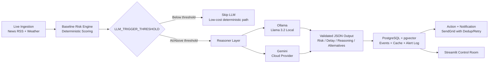

# Vanguard

Autonomous AI Supply Chain Risk Agent for proactive disruption monitoring, route-risk reasoning, and operational alerts.

## Project Overview
Vanguard is a production-oriented agent system that continuously monitors shipping risk signals for critical routes (for example, Red Sea/Suez and Singapore Strait), scores disruption probability, and recommends response actions.

It solves a practical operations problem: teams react late because risk signals are fragmented across news, weather, and historical context. Vanguard unifies these signals into a single control loop with deterministic scoring, LLM reasoning, and alert dispatch.

## Core Architecture
Vanguard uses a hybrid architecture where deterministic logic controls cost, PostgreSQL stores state, and an LLM provider can be switched between local Ollama and cloud Gemini.

### High-Level Flow


### Component Breakdown
| Layer | What it does | Primary tech |
|---|---|---|
| Ingestion | Pulls near-real-time disruption signals from news + weather | `aiohttp`, RSS, OpenWeather |
| Baseline Engine | Computes deterministic risk before LLM call | Python rules engine |
| Reasoning Layer | Produces structured risk reasoning in strict JSON | Ollama (`llama3.2`) or Gemini |
| State + Memory | Stores events, reasoning cache, dispatch logs, vectors | PostgreSQL 15 + `pgvector` |
| Action + Alerting | Drafts actions and dispatches deduplicated alerts | SendGrid, retry policy |
| Visualization | Operations dashboard for trend + alert visibility | Streamlit |

## Key Features
### 1) Real-time Ingestion (News/Weather)
- Asynchronous live polling of Google News RSS and weather conditions.
- Route-aware event normalization into a single `RiskEvent` schema.

### 2) Gated Reasoning (Token-Saving Threshold Logic)
- Deterministic baseline risk is always computed first.
- LLM call is only triggered above `LLM_TRIGGER_THRESHOLD`.
- Reduces token/API cost while preserving high-risk escalation quality.

### 3) Hybrid LLM Support (Local Ollama vs Cloud Gemini)
- `LLM_PROVIDER=ollama` for local/private reasoning.
- `LLM_PROVIDER=gemini` for cloud reasoning when needed.
- Same strict JSON contract in both modes:

```json
{
  "risk_score": 78,
  "predicted_delay_days": 4.5,
  "alternatives": ["Reroute via Cape", "Shift buffer stock to west hub"],
  "reasoning": "Escalation in route conflict and congestion indicators...",
  "confidence_score": 0.81
}
```

### 4) Secure Notification System (SendGrid with Dedup)
- Dedup window prevents repeated alert spam.
- Retry pipeline captures failures and re-attempts delivery.
- Dispatch log is persisted for auditability.

## Quick Start Guide
### One-command launch
```bash
./launch_vanguard.sh
```

This command performs:
1. Python environment setup and dependency sync.
2. Startup health checks (DB + selected LLM provider + optional SendGrid check).
3. Database migration.
4. Background autonomous cron runner start.
5. Streamlit dashboard boot on port `8501`.

### Important: Dashboard Access
Set `DASHBOARD_PASSWORD` in `.env`.
If empty, dashboard login is intentionally disabled.

```bash
sed -i 's|^DASHBOARD_PASSWORD=.*|DASHBOARD_PASSWORD=StrongPass123!|' .env
```

## Environment Configuration
Use `.env.example` as the template.

| Variable | Required | Default | Description |
|---|---|---|---|
| `DATABASE_URL` | Yes | - | PostgreSQL connection string used by health, migrations, storage. |
| `LLM_PROVIDER` | Yes | `ollama` (example) / app default `gemini` | Reasoning backend selector: `ollama` or `gemini`. |
| `OLLAMA_MODEL` | If `LLM_PROVIDER=ollama` | `llama3` | Ollama model tag (for example `llama3.2:latest`). |
| `OLLAMA_BASE_URL` | If `LLM_PROVIDER=ollama` | `http://localhost:11434` | Ollama API base URL. |
| `GEMINI_API_KEY` | If `LLM_PROVIDER=gemini` | - | Gemini API key for cloud reasoning. |
| `OPENWEATHER_API_KEY` | No | empty | Enables weather enrichment in ingestion. |
| `ENABLE_EMBEDDINGS` | No | `false` | Stores semantic vectors in pgvector-backed tables. |
| `LLM_TRIGGER_THRESHOLD` | No | `45` | Baseline threshold to decide whether LLM call is needed. |
| `SENDGRID_API_KEY` | No | empty | Required only for live email delivery. |
| `SENDER_EMAIL` | No | empty | Verified SendGrid sender address. |
| `ALERT_RECIPIENTS` | No | empty | Comma-separated recipients list. |
| `ALERT_DEDUP_HOURS` | No | `6` | Suppresses duplicate alert sends in lookback window. |
| `ALERT_MAX_RETRIES` | No | `3` | Max retry attempts per failed dispatch. |
| `MONITOR_ROUTES` | No | preset routes | Comma-separated route list for cron monitoring. |
| `MONITOR_INTERVAL_SECONDS` | No | `3600` | Interval between autonomous monitoring cycles. |
| `RETRY_LOOKBACK_HOURS` | No | `24` | Lookback window for retry candidate selection. |
| `RETRY_BATCH_SIZE` | No | `50` | Max failed records retried in one cycle. |
| `DASHBOARD_PASSWORD` | Recommended | empty | Password gate for Streamlit control room. |

## Tech Stack
| Category | Stack |
|---|---|
| Runtime | Python 3.11+ |
| AI Reasoning | Ollama (`llama3.2`) and Google Generative AI (Gemini) |
| Data + Memory | PostgreSQL 15, `pgvector`, `asyncpg` |
| Dashboard | Streamlit |
| Integrations | SendGrid, OpenWeather, Google News RSS |
| Async + Validation | `aiohttp`, `pydantic` |

## Visual Elements
### Dashboard Screenshot (Placeholder)
`docs/images/dashboard-overview.png`

### System Architecture Diagram (Placeholder)
`docs/images/architecture-flow.png`

### Risk Trend + Alert Log Screenshot (Placeholder)
`docs/images/risk-trend-alert-log.png`

## Development Commands
```bash
# Health + migration
python -m src.vanguard.health --check-only
python -m src.vanguard.migrate

# One cycle (safe test)
python -m src.vanguard.cron --once --dry-run

# Manual crisis injection (safe dry-run alert dispatch by default)
./simulate_crisis.sh \
  --route "Singapore Strait -> India" \
  --headline "Major storm in Singapore causing vessel bunching"

# Equivalent module command
python -m src.vanguard.simulate_crisis \
  --route "Singapore Strait -> India" \
  --headline "Major storm in Singapore causing vessel bunching"

# Tests
PYTHONPATH=src pytest -q
```

## Open Source
- License: `MIT` (see `LICENSE`)
- Contribution guide: `CONTRIBUTING.md`
- Security reporting: `SECURITY.md`
